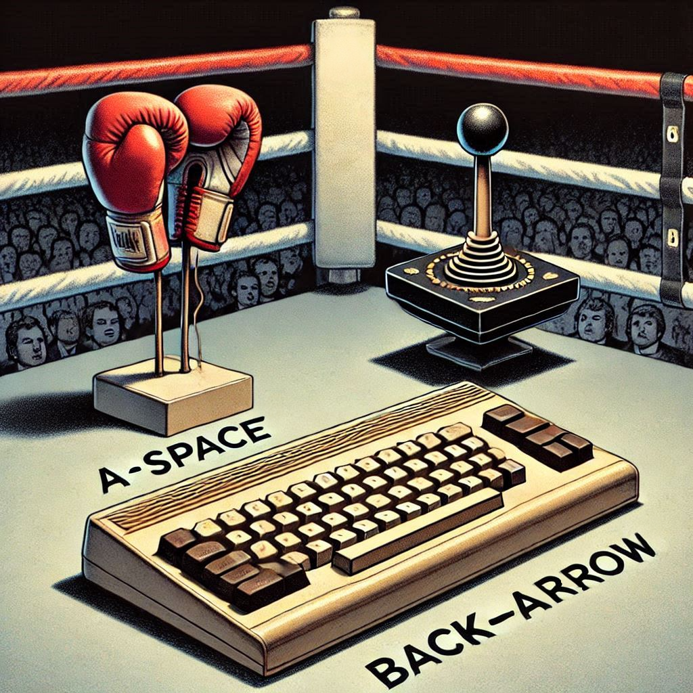

# scanjoy - irq (every jiffy) scan of keyboard and joysticks avoiding conflict

This code is for the Commodore 64

Since joystick #1 and keyboard inputs are read from the same ports, they can conflict when the same lines are in use.   Joystick inputs can be mistaken for keyboard inputs, and vice versa.  Giving priority to the joystick and reading with the keyboard outputs disabled, conflicts are addressed.  Joystick #1 is read accurately, and while joystick inputs are active, the keyboard will ignore those lines on its reads.   So the joystick will not trigger keyboard inputs, and keyboard inputs will not trigger the joystick.  The only caveat is not being able to detect certain keystrokes while some joystick inputs are active.  It is expected that the user is only using one at a time.  When developing a game for simultaneous inputs, avoiding certain conflicting keystrokes (lower 5 columns of the keyboard matrix) may be necessary depending on how simultaneous use is to be supported.

See the [scankeys](https://github.com/davervw/scankeys) project for a demo of scanning the keyboard and you can see how joystick inputs conflict.

More content is available at [blog entry](https://techwithdave.davevw.com/2024/12/avoid-conflicts-between-c64-keyboard.html).

Usage:

````
LOAD "SCANJOY",8,1
SYS 49152
````

Joystick values are continuously stored at memory 253 and 254.

Optional (demo prototype showing joysticks and keyboard values):
````
LOAD "TEST",8
RUN
````

PRESS STOP+RESTORE to restore normal (conflicting) behavior, uninstalling vector changes.


